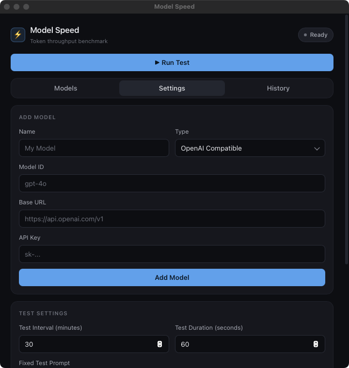

<p align="center">
  
</p>

<h1 align="center">Model Speed Tester</h1>

<p align="center">用于测试多个 AI 模型 token 速度的桌面应用。</p>

---



## 功能

- ⚡ 同时测试多个模型（并发）
- ⏱️ 自定义测试间隔（默认 30 分钟）
- 🔧 支持 OpenAI 兼容 API 和 Anthropic API
- 📊 实时显示 tok/s、TTFT、总耗时
- 💾 历史记录（JSON 存储）
- 📤 导出历史记录
- 🔔 可选桌面通知
- 📌 菜单栏常驻

## 运行

### 开发模式

```bash
cd model-speed

# 安装 Rust（如未安装）
curl --proto '=https' --tlsv1.2 -sSf https://sh.rustup.rs | sh

# 开发运行
cargo tauri dev
```

### 构建

```bash
cargo tauri build
```

构建完成后，应用位于 `src-tauri/target/release/` 目录。

## 图标

应用需要图标文件才能打包。请从 https://icons8.com 或其他来源获取图标，放到 `src-tauri/icons/` 目录：

- `32x32.png`
- `128x128.png`
- `128x128@2x.png`
- `icon.icns` (macOS)
- `icon.ico` (Windows)

或者使用在线工具将 PNG 转换为所需格式。

## 配置存储

配置文件位于：
- macOS: `~/Library/Application Support/model-speed/`
- Windows: `%APPDATA%/model-speed/`

包含：
- `config.json` - 模型配置
- `settings.json` - 设置
- `history.json` - 测试历史

## 技术栈

- Tauri 2.x（Rust 后端 + Web 前端）
- 支持 macOS 和 Windows
